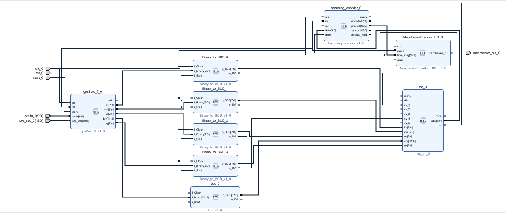

# GPS-ICD-060A Compatible HaveQuick‐II Time Distribution Module (FPGA Design)

This project contains an FPGA implementation of a **HaveQuick-II time distribution transmitter**, compliant with the **GPS ICD-060A** specification.

The module receives a reference **1PPS** signal from a GNSS receiver and immediately outputs the current **UTC Time-of-Day (TOD)** as a **Manchester (bi-phase level)** encoded serial data stream.  
Each TOD field (hour, minute, second) is formatted in **BCD** and protected with **Hamming(7,4)** parity before being Manchester-encoded and sent to the external interface.

---

## ✅ Transmitter Function

| Stage | Description |
|------|---------------------------------------------------------------------|
| PPS Edge Detection | 1PPS reference rising edge is used as transmission start |
| TOD Encoder | UTC hh:mm:ss converted to BCD format |
| Hamming Encoder | Hamming(8,4) applied to each 4-bit BCD field |
| Manchester Encoder | Biphase-level encoding (300 µs High + 300 µs Low) |
| Serial Output | Manchester bit stream transmitted over TX pin |

📝 Frame structure and timing fully follow the **Time Mark Distribution (HaveQuick)** specification in **GPS-ICD-060A**.

---

## ⏱ Timing Parameters (ICD-060A)

| Parameter       | Value                                         |
|----------------|-----------------------------------------------|
| Bit period      | **600 µs** (Manchester bi-phase level)        |
| Symbol shape    | 300 µs High + 300 µs Low                      |
| Frame duration  | 72–80 ms  (depending on optional fields)      |
| Time format     | UTC TOD (hh:mm:ss / BCD + Hamming codes)      |

---

## 🧱 RTL Source Files

| File                    | Function                                              |
|-------------------------|--------------------------------------------------------|
| `TOD_Generator.v`       | UTC Time-of-Day formatter (hh:mm:ss → BCD)             |
| `data_to_hamming.v`     | BCD → Hamming(7,4) encoder                             |
| `hamming.v`             | Hamming(7,4) verifier / encoder                        |
| `fifo_h_to_m.v`         | FIFO between Hamming output and Manchester encoder     |
| `bcd.v`, `bin_to_bcd.v` | Basic binary / BCD conversion modules                  |
| `top.v`                 | Top-level HaveQuick-II transmitter module              |

---

## 📄 Documentation

Detailed 21-page design report:  
👉 `docs/HaveQuick_Report.pdf`

Includes:

- GPS-ICD-060A Time Distribution overview
- Hamming code and Manchester encoder implementation
- RTL block diagrams and simulation waveforms

---

## 🧪 Simulation

Simulation test benches (`src/sim/`) cover:

- PPS trigger → TOD transmission
- Frame integrity
- Hamming error injection
- Manchester output waveform validation

---

## 👨‍💻 Author

**Peyman Cibalı**  
Electrical & Electronics Engineer — Digital Design / FPGA
